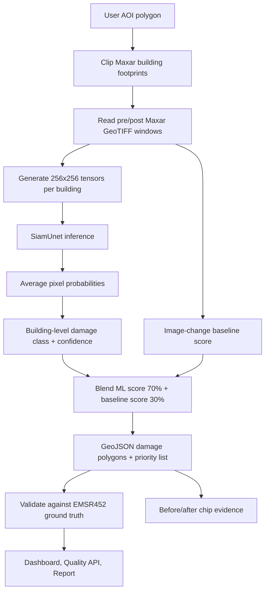
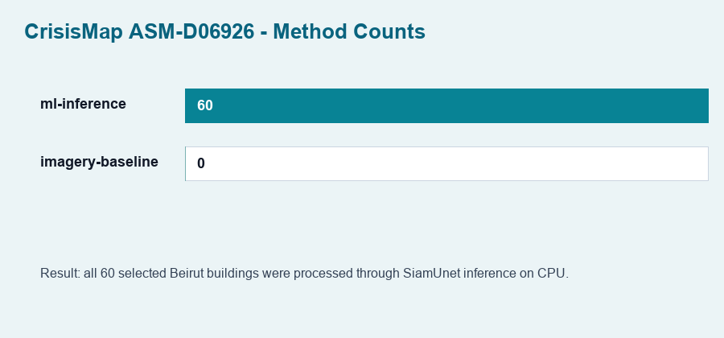
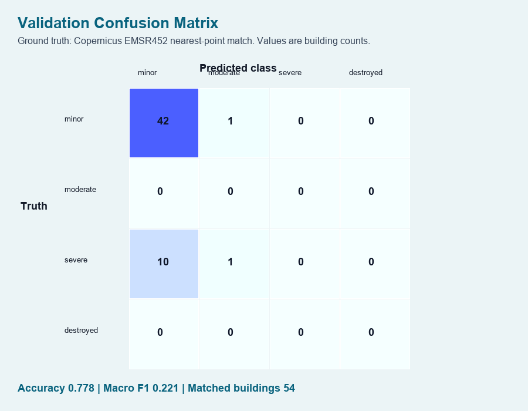
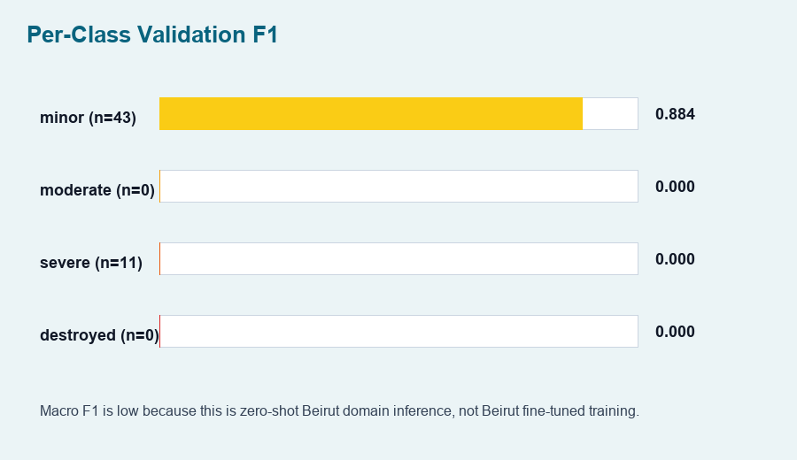
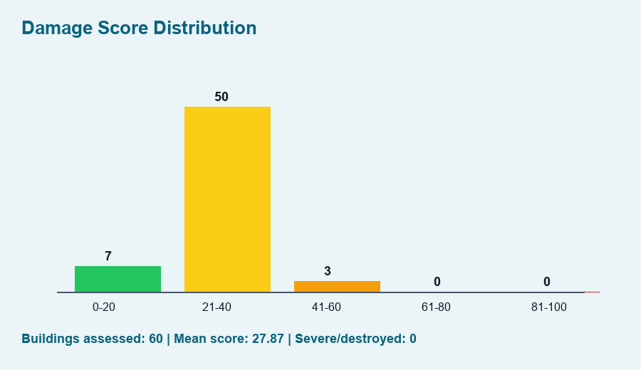
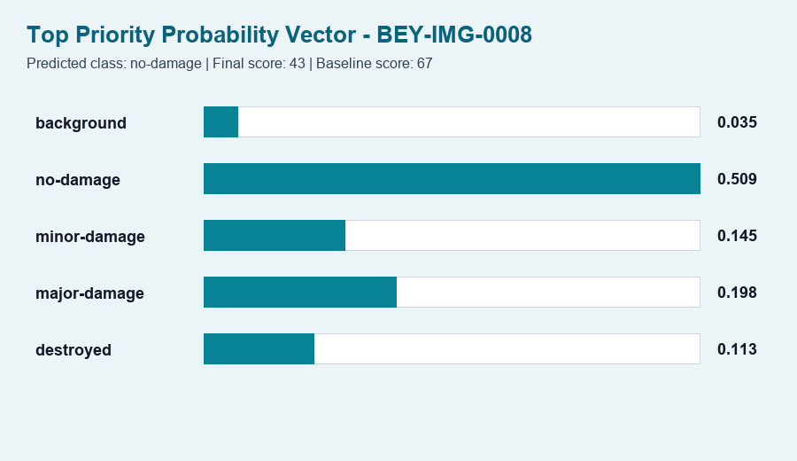

# CrisisMap ML Inference Report

Assessment: `ASM-D06926`

Important clarification: this run was **not training/fine-tuning**. It was local **inference** using an existing checkpoint:

```text
data/raw/models/microsoft_building_damage_assessment_cnn_siamese/model_best.pth.tar
```

The backend loaded this checkpoint into the `SiamUnet` architecture, generated pre/post chips from Beirut Maxar imagery and building footprints, predicted damage per building, then validated the predictions against Copernicus EMSR452 ground-truth points.

## Code Locations

Core model architecture:

```text
data/raw/models/microsoft_building_damage_assessment_cnn_siamese/end_to_end_Siam_UNet.py
```

Backend inference wrapper:

```text
backend/app/services/geospatial/ml_inference.py
```

Beirut geospatial pipeline:

```text
backend/app/services/geospatial/imagery_baseline.py
```

API routes for quality and chip evidence:

```text
backend/app/api/v1/routes/assessments.py
```

Frontend evidence display:

```text
frontend/src/app/priority/[id]/page.tsx
```

## Architecture Used

Architecture: `SiamUnet`

Inputs:

- `x1`: pre-disaster RGB chip
- `x2`: post-disaster RGB chip
- chip size used by CrisisMap inference: `256x256`
- bands used: RGB bands 1, 2, 3 from local Maxar GeoTIFF

Outputs from model forward pass:

- pre-disaster building segmentation logits
- post-disaster building segmentation logits
- damage classification logits

Damage classes:

```text
background
no-damage
minor-damage
major-damage
destroyed
```

CrisisMap converts pixel-level damage logits into one building-level prediction by averaging softmax probabilities across the chip.

## Method Flow



## Training Details

Training was not executed in this project run.

So these values are **not applicable for our local run**:

- local train/val split: not run
- local batch size: not run
- local epochs: not run
- local optimizer: not run
- local loss curve: not available

The checkpoint source documentation says the original model was trained on xBD/xView2-style data, with 1024x1024 xBD tiles cropped into 256x256 patches. The documented split examples include `80:10:10` and `90:10:0`, depending on experiment configuration. CrisisMap currently uses that checkpoint for zero-shot Beirut inference, not Beirut-specific fine-tuning.

## Local Inference Configuration

```text
ML_MODEL_ENABLED=true
ML_MODEL_CHECKPOINT_PATH=../data/raw/models/microsoft_building_damage_assessment_cnn_siamese/model_best.pth.tar
ML_MODEL_DEFINITION_PATH=../data/raw/models/microsoft_building_damage_assessment_cnn_siamese/end_to_end_Siam_UNet.py
ML_MODEL_DEVICE=cpu
```

Installed dependency:

```text
torch==2.5.1+cpu
```

Assessment input:

```text
AOI: Beirut Port polygon
processing_priority: economy
selected buildings: 60
pre imagery: Maxar pre-event GeoTIFF
post imagery: Maxar post-event GeoTIFF
footprints: Maxar Beirut 2D building shapefile
ground truth: Copernicus EMSR452 damage points
```

Runtime:

```text
~51.21 seconds on CPU for 60 buildings
```

## Result Summary

```text
pipeline method: ml-inference
ml-inference count: 60
imagery-baseline fallback count: 0
buildings assessed: 60
severe/destroyed predicted: 0
estimated population impact: ~2k
validation matched buildings: 54
accuracy: 0.778
macro F1: 0.221
```

The score is intentionally treated as an early baseline because the checkpoint has not been fine-tuned for Beirut Maxar imagery.

## Charts

Method counts:



Confusion matrix:



Per-class F1:



Damage score distribution:



Top priority probability vector:



## Why The F1 Is Still Low

This is zero-shot inference. The checkpoint was trained on xBD disaster imagery patterns, while this app is testing Beirut Maxar imagery, Maxar footprints, and Copernicus EMSR452 point labels. Domain shift is expected.

The next ML step should be:

1. Build a reproducible Kaggle/Colab fine-tuning notebook.
2. Train/fine-tune on xBD challenge + Tier3 data.
3. Calibrate thresholds using Beirut validation labels.
4. Export a new checkpoint.
5. Replace `model_best.pth.tar` or add a new checkpoint path in `.env`.
