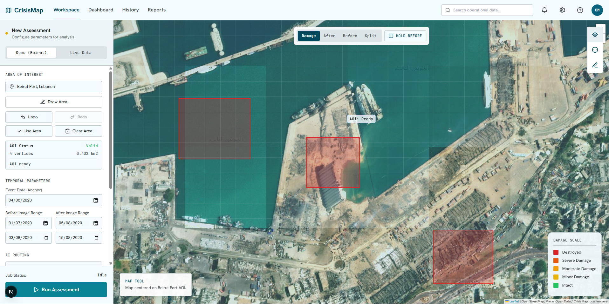
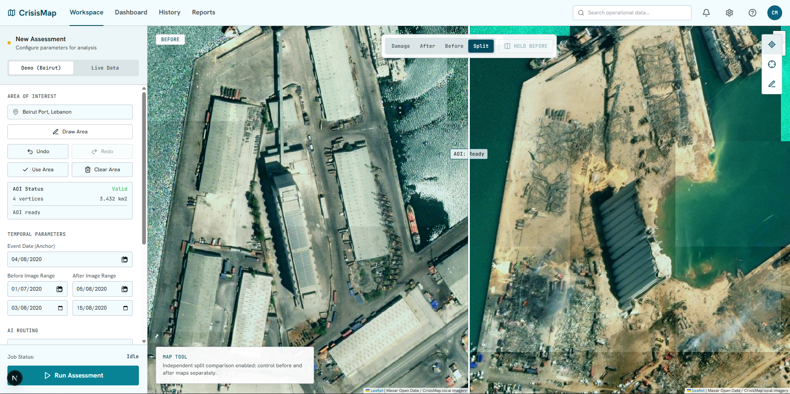
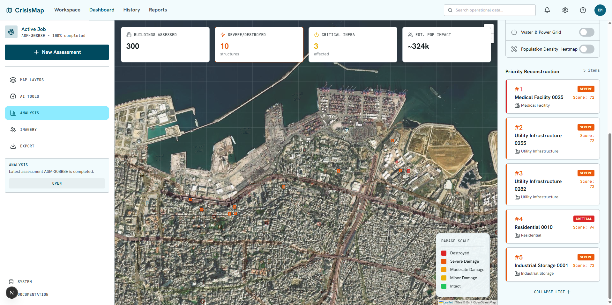
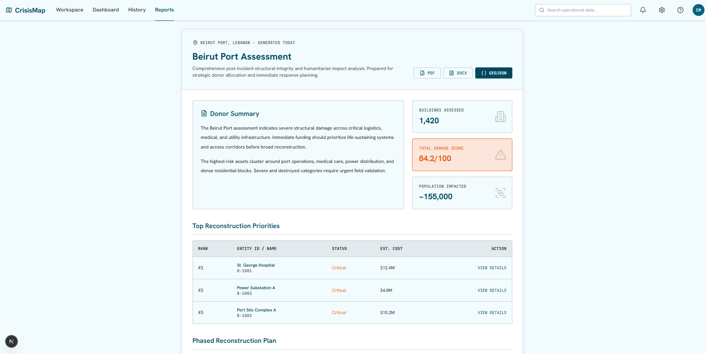
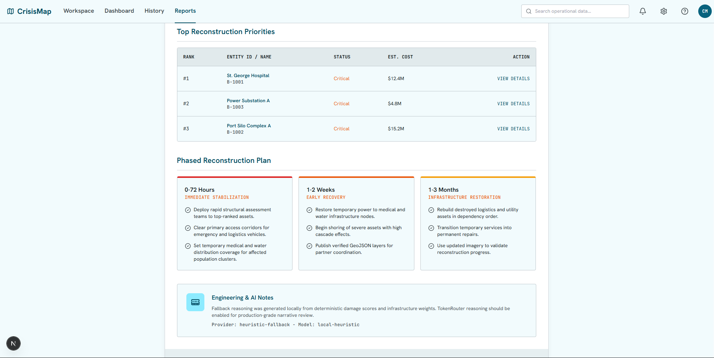

<div align="center">
  <h1>🌍 CrisisMap</h1>
  <p><strong>AI-Powered Humanitarian Infrastructure Damage Assessment Dashboard</strong></p>
  
  [](https://fastapi.tiangolo.com/)
  [](https://nextjs.org/)
  [](https://www.postgresql.org/)
  [](https://pytorch.org/)

  <i>Built for humanitarian responders, NGOs, and disaster analysis teams to rapidly assess infrastructure damage in conflict and disaster zones.</i>
</div>

---

## 📖 Overview

**CrisisMap** bridges the gap between raw satellite imagery and actionable humanitarian response. During a crisis, assessing infrastructure damage quickly and accurately is critical. This platform provides an end-to-end, map-first workspace that utilizes local AI inference (Siamese CNNs) and automated reasoning to identify destroyed buildings, assess critical infrastructure impact, and generate prioritized reconstruction reports.

Designed with robust **Stitch UI/UX** principles, CrisisMap ensures operations remain functional even with fallback heuristics, making it highly resilient in critical scenarios.

## 🚀 Key Capabilities

- **Interactive Map-First Workspace:** Define Areas of Interest (AOI) directly on a dynamic Leaflet satellite map. Features include GeoJSON damage polygons, severity heatmaps, and customizable map layers.
- **Deep Learning Damage Inference:** Leverages a `SiamUnet` Siamese CNN to analyze pre- and post-disaster satellite imagery, accurately detecting structural changes and damage severity.
- **Automated AI Reasoning:** Integrates a TokenRouter-compatible reasoning adapter to synthesize raw geospatial data into human-readable, strategic impact reports.
- **Actionable Export Generation:** Instantly generate and download donor-ready reconstruction reports in PDF, DOCX, and GeoJSON formats.
- **Resilient Architecture:** Built with deterministic fallback heuristics to guarantee damage assessments even when AI endpoints are degraded.

## 📸 Visual Walkthrough

### 1. Assessment Workspace
The entry point for disaster analysis. Operators can draw their Area of Interest (AOI) over affected zones and configure temporal parameters for the AI to analyze.
<div align="center">
  
</div>

### 2. Pre/Post Split Comparison
A powerful split-view mode that allows human operators to visually cross-verify the AI's findings against pre-disaster and post-disaster high-resolution imagery.
<div align="center">
  
</div>

### 3. Results & Prioritization Dashboard
Once inference is complete, the dashboard aggregates the data into severity metrics (Minor, Moderate, Severe, Destroyed) and highlights critical infrastructure failures (e.g., hospitals, power grids).
<div align="center">
  
</div>

### 4. Automated Reporting & Donor Summary
The system automatically drafts a comprehensive situation report, distilling millions of pixels of damage data into a concise summary tailored for donors and rapid response teams.
<div align="center">
  
</div>

### 5. Phased Reconstruction Planning
Beyond simple damage grading, the AI generates a phased reconstruction timeline (0-72 hours, 1-2 weeks, 1-3 months) prioritizing life-sustaining infrastructure.
<div align="center">
  
</div>

## 🛠️ Architecture & Tech Stack

CrisisMap is a modern, containerized microservices application designed for both cloud and local edge deployments.

- **Frontend:** Next.js (App Router), React, TailwindCSS, Leaflet.js
- **Backend API:** Python, FastAPI (`/api/v1`), SQLAlchemy
- **Machine Learning Engine:** PyTorch (Local Inference with SiamUnet)
- **Data Persistence:** PostgreSQL with PostGIS extension for spatial queries
- **Background Processing:** Celery Workers backed by Redis
- **Containerization:** Fully orchestrated via Docker Compose

## ⚙️ Getting Started

### 1. Environment Setup

Clone the repository and prepare the environment variables:
```bash
git clone https://github.com/Gimm17/CrisisMap.git
cd CrisisMap
cp .env.example .env
```
> [!IMPORTANT]
> Keep your `TOKENROUTER_API_KEY` secure on the server side. Never expose it in client-facing frontend code.

### 2. Running Locally (Development Mode)

**Start the Backend (FastAPI)**
```bash
cd backend
python -m venv .venv
# Activate: `.venv\Scripts\activate` (Windows) or `source .venv/bin/activate` (Mac/Linux)
pip install -r requirements.txt
uvicorn app.main:app --reload
```
*The API will be available at `http://localhost:8000`*

**Start the Frontend (Next.js)**
```bash
cd frontend
npm install
npm run dev
```
*The dashboard will be available at `http://localhost:3000`*

### 3. Production Deployment (Docker)

To spin up the entire stack (API, Frontend, PostGIS, Redis, Celery) in isolated containers:
```bash
docker compose up --build -d
```

## 📡 Core API Endpoints

CrisisMap exposes a robust RESTful API for headless integration with external disaster management systems:

| Method | Endpoint | Description |
| :--- | :--- | :--- |
| `POST` | `/api/v1/assessments` | Submit a new geographic area for damage assessment |
| `GET` | `/api/v1/assessments` | Retrieve the history of all processed jobs |
| `GET` | `/api/v1/assessments/{id}` | Fetch metadata and status for a specific assessment |
| `GET` | `/api/v1/assessments/{id}/buildings.geojson` | Retrieve raw geospatial damage polygons |
| `GET` | `/api/v1/assessments/{id}/priorities` | Get a ranked list of critical infrastructure damage |
| `GET` | `/api/v1/assessments/{id}/report` | Generate the AI-driven narrative reasoning report |
| `PATCH`| `/api/v1/settings/analysis` | Configure global ML thresholds and system settings |

## 🎯 Roadmap

- [ ] **Database Migration:** Fully deprecate the local JSON file store in favor of PostgreSQL/PostGIS.
- [ ] **Live Data Integration:** Implement live adapters for Sentinel Hub, OpenStreetMap, and HDX to replace demo fixtures.
- [ ] **Dynamic Export Engine:** Replace placeholder PDF/DOCX templates with dynamically generated artifacts based on active data.
- [ ] **Enterprise Authentication:** Implement RBAC (Role-Based Access Control) and team workspaces prior to production rollout.

---
<div align="center">
  <i>Developed to empower those who respond first.</i>
</div>
